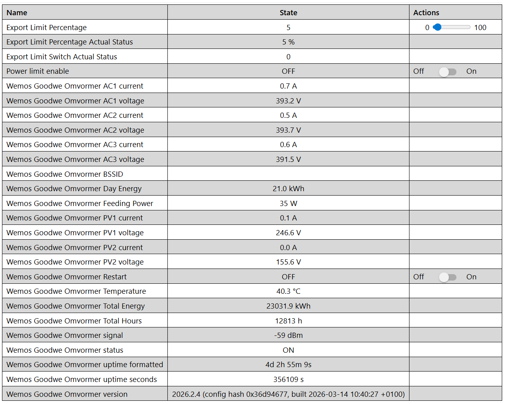
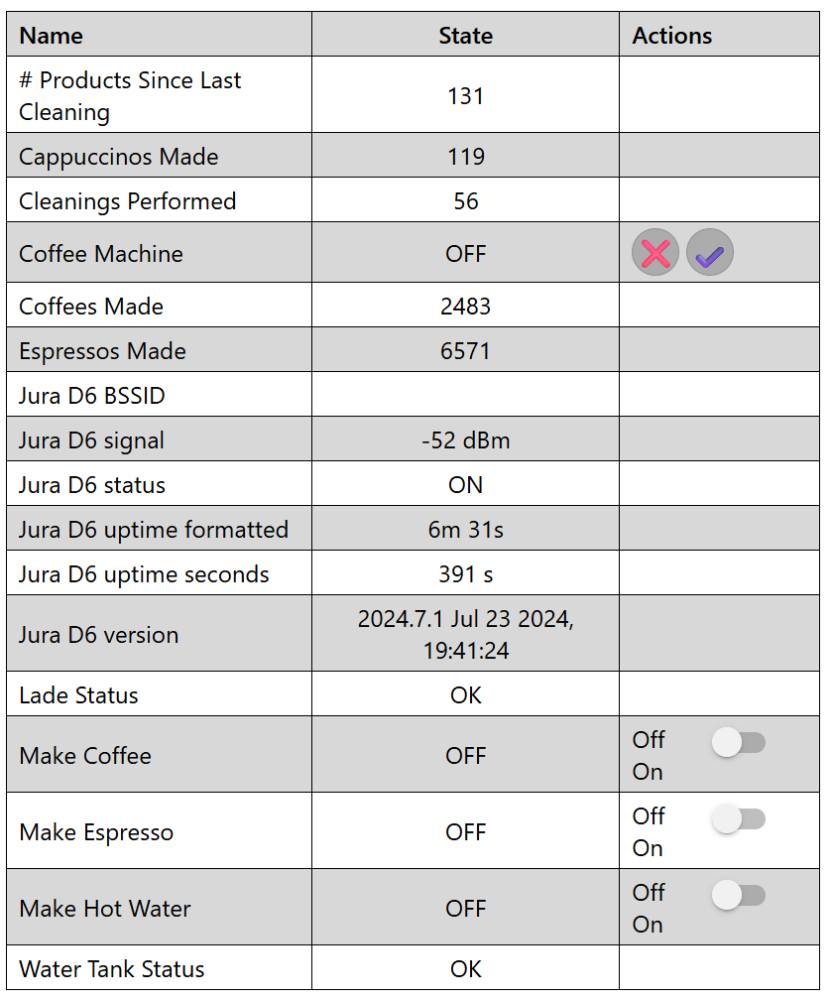

# ESPHome Configurations

(Some of) my ESPHome configurations for home automation devices.

## GoodWe PV interter [goodwe-pv-inverter.yaml](goodwe-pv-inverter.yaml)

Hardware: 
- ESP8266 (Wemos Mini D1) + RS485 transceiver module
- GW6K-DT inverter

Purpose:
- Readout all inverter statistics (see screenshot)
- Export limit to control the PV output to the grid

## Jura Coffee Machine [jura.yaml](jura.yaml)

Hardware: 
- ESP8266 (Wemos Mini D1)
- Jura D6 Coffee Machine

Purpose:
- Readout all Coffee machine statistics (see screenshot)
- Let the Sonos speak if the water tank is empty for example (via Home Assistant automation
- Needs file [jura_coffee.h](jura_coffee.h) to work!

## Notes

- All API encryption keys and OTA passwords are referenced via `!secret` from `secrets.yaml`
- Home Assistant entities are in Dutch
- Tested with ESPHome 2026.x

## License

MIT
